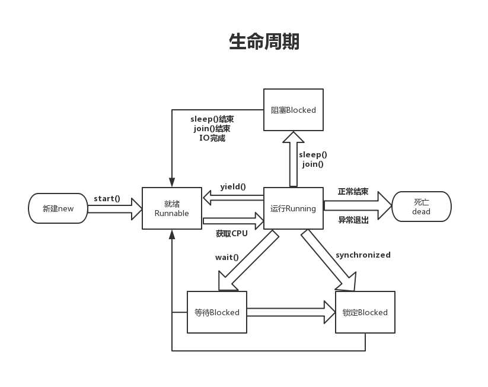

## 了解多线程（概念、使用、生命周期及线程安全问题）
- **概念：**
>     1.进程是系统进行资源分配和调度的基本单位
>     2.线程线程是进程中的一个实体，是被系统独立调度和分派的基本单位，是程序执行流的最小单元
- **线程安全：**
1. 线程安全需要遵守JMM(java内存模型)的规范
- [x] **可见性**（当一个线程修改了共享变量时，另一个线程可以读取到这个修改后的值）
- [x] **原子性**（一个操作是不可中断的，要么全部执行成功要么全部执行失败）
- [x] **有序性**（如果在本线程内观察，所有的操作都是有序的；如果在一个线程观察另一个线程，所有的操作都是无序的）  

- **线程安全需使用：**
1. 加synchronized关键字（完整持有JMM特性）
2. 加volitile关键字（缺少原子性）  

- **多线程的使用**
1. Thread类

```
public class MyThread extends Thread {
    @Override
    public void run() {
        ....
    }
}
```
2. Runnable接口

```
public class MyThread implements Runnable{
    @Override
    public void run(){
        ....    
    }
}
```


- **线程的生命周期**
  


## synchronized原理


> - **同步语句块**的实现使用的是**monitorenter** 和 **monitorexit** 指令，其中**monitorenter**指令指向同步代码块的开始位置，**monitorexit**指令则指明同步代码块的结束位置，当执行**monitorenter**指令时，当前线程将试图获取 objectref(即对象锁) 所对应的 monitor 的持有权,当 objectref 的 monitor 的进入计数器为 0，那线程可以成功取得 monitor，并将计数器值设置为 1，取锁成功。如果当前线程已经拥有 objectref 的 monitor 的持有权，那它可以重入这个 monitor，重入时计数器的值也会加 1。倘若其他线程已经拥有 objectref 的 monitor 的所有权，那当前线程将被阻塞，直到正在执行线程执行完毕，即monitorexit指令被执行，执行线程将释放monitor(锁)并设置计数器值为0,其他线程将有机会持有 monitor.  

> - **synchronized方法**实现是隐式的，不通过字节码指令来控制的，它实现在方法调用和返回操作之中。JVM可以从方法常量池中的方法表结构中的 **ACC_SYNCHRONIZED** 访问标志区分一个方法是否同步方法。当方法调用时，调用指令将会 检查方法的 **ACC_SYNCHRONIZED** 访问标志是否被设置，如果设置了，执行线程将先持有monitor（管程）， 然后再执行方法，最后再方法完成(无论是正常完成还是非正常完成)时释放monitor。在方法执行期间，执行线程持有了monitor，其他任何线程都无法再获得同一个monitor。如果一个同步方法执行期间抛 出了异常，并且在方法内部无法处理此异常，那这个同步方法所持有的monitor将在异常抛到同步方法之外时自动释放。  


## synchronized使用  
  
- 方法上使用

```
public synchronized void syncTask(){
    ....
}
```  
- 修饰静态方法  


```
private synchronized static void increaseCount() {
    ....
}
```  

- 修饰代码块  


```
synchronized (this) {
    ....
}
```  

- [x] **总结**
1. 修饰普通方法 一个对象中的加锁方法只允许一个线程访问。但要注意这种情况下锁的是访问该方法的实例对象， 如果多个线程不同对象访问该方法，则无法保证同步。
2. 修饰静态方法 由于静态方法是类方法，所以这种情况下锁的是包含这个方法的类，也就是类对象；这样如果多个线程不同对象访问该静态方法，也是可以保证同步的。
3. 修饰代码块 其中普通代码块 如Synchronized（obj） 这里的obj 可以为类中的一个属性、也可以是当前的对象，它的同步效果和修饰普通方法一样；Synchronized方法 （obj.class）静态代码块它的同步效果和修饰静态方法类似。
  
## volitile的原理和使用  

> volatile可以保证线程可见性且提供了一定的有序性，但是无法保证原子性。在JVM底层volatile是采用“内存屏障”来实现的。 

- **实现原理**
1. 可见性实现  
（1）修改volatile变量时会强制将修改后的值刷新的主内存中。  
（2）修改volatile变量后会导致其他线程工作内存中对应的变量值失效。因此，再读取该变量值的时候就需要重新从读取主内存中的值。 
2. 有序性实现  
为了实现volatile可见性和happen-befor的语义。JVM底层是通过一个叫做“内存屏障”的东西来完成。内存屏障，也叫做内存栅栏，是一组处理器指令，用于实现对内存操作的顺序限制。
  
- **使用**  
volatile的使用比较简单，直接可以加在类字段上即可，如：

```
private volatile boolean flag;
```  
  
## Java锁的类型  
  
- **公平锁/非公平锁**  
1. **公平锁**是指多个线程按照申请锁的顺序来获取锁。  
2. **非公平锁**是指多个线程获取锁的顺序并不是按照申请锁的顺序，有可能后申请的线程比先申请的线程优先获取锁。有可能，会造成优先级反转或者饥饿现象。
  
- **可重入锁**  
> **可重入锁**又名递归锁，是指在同一个线程在外层方法获取锁的时候，在进入内层方法会自动获取锁。
  
- **独享锁/共享锁**  
1. 独享锁是指该锁一次只能被一个线程所持有。如`synchronized`就是独享锁。
2. 共享锁是指该锁可被多个线程所持有。  
  
- **互斥锁/读写锁**  
`独享锁/共享锁`就是一种广义的说法，互斥锁/读写锁就是具体的实现。
互斥锁在Java中的具体实现就是ReentrantLock
读写锁在Java中的具体实现就是ReadWriteLock  

- **乐观锁/悲观锁**  
>   乐观锁与悲观锁不是指具体的什么类型的锁，而是指看待并发同步的角度。  
悲观锁认为对于同一个数据的并发操作，一定是会发生修改的，哪怕没有修改，也会认为修改。因此对于同一个数据的并发操作，悲观锁采取加锁的形式。悲观的认为，不加锁的并发操作一定会出问题。  
乐观锁则认为对于同一个数据的并发操作，是不会发生修改的。在更新数据的时候，会采用尝试更新，不断重新的方式更新数据。乐观的认为，不加锁的并发操作是没有事情的。  
1. 悲观锁在Java中的使用，就是利用各种锁。  
2. 乐观锁在Java中的使用，是无锁编程，常常采用的是CAS算法，典型的例子就是原子类，通过CAS自旋实现原子操作的更新。  
  
- **偏向锁/轻量级锁/重量级锁**  

`这三种锁是指锁的状态`,并且是针对synchronized的。  
1. 偏向锁是指一段同步代码一直被一个线程所访问，那么该线程会自动获取锁。降低获取锁的代价。  
2. 轻量级锁是指当锁是偏向锁的时候，被另一个线程所访问，偏向锁就会升级为轻量级锁，其他线程会通过自旋的形式尝试获取锁，不会阻塞，提高性能。  
3. 重量级锁是指当锁为轻量级锁的时候，另一个线程虽然是自旋，但自旋不会一直持续下去，当自旋一定次数的时候，还没有获取到锁，就会进入阻塞，该锁膨胀为重量级锁。重量级锁会让其他申请的线程进入阻塞，性能降低。  
  
- **自旋锁**  

自旋锁是指尝试获取锁的线程不会立即阻塞，而是采用循环的方式去尝试获取锁，这样的好处是减少线程上下文切换的消耗，缺点是循环会消耗CPU。


